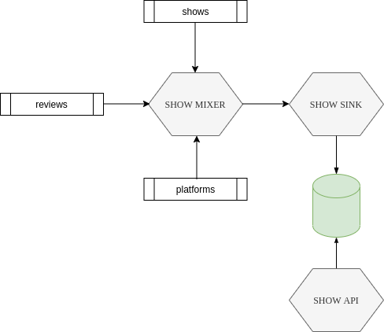
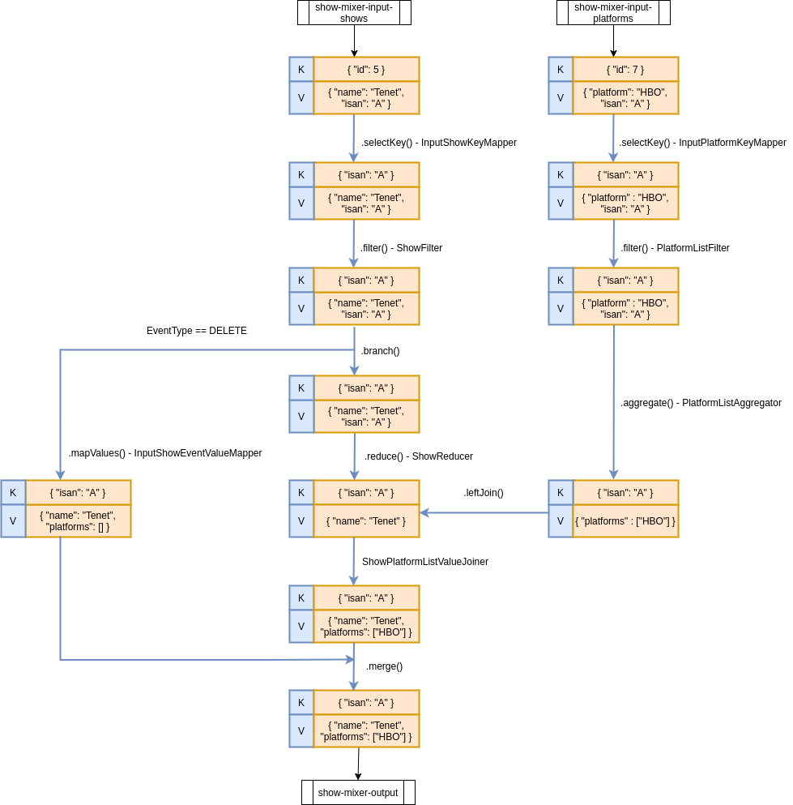

# microservices

Repositorio para la formación en microservicios para el equipo ECI.

## Diagrama de dominio



## Entorno de desarrollo

Crear red interna:

```bash
docker network create shows
```

Iniciar Kafka + MongoDB:

```bash
docker-compose -f /path/to/infraestructure.yml up -d
```

Detener entorno:

```bash
docker-compose -f /path/to/infraestructure.yml stop
```

Borrar entorno:

```bash
docker-compose -f /path/to/infraestructure.yml down
```

## Topología

### show-mixer

